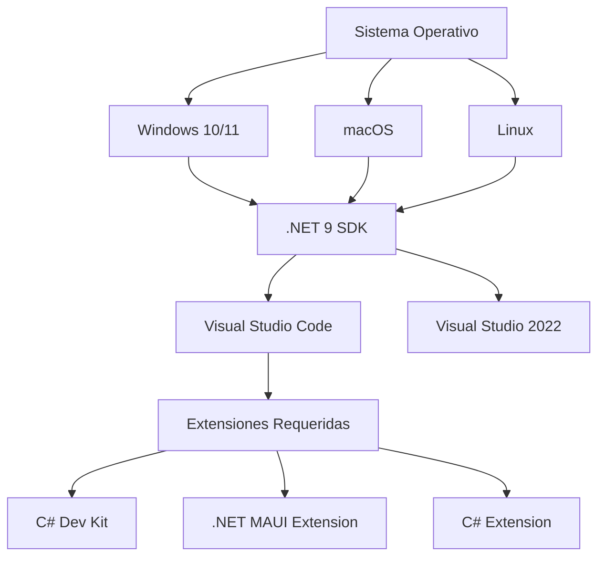
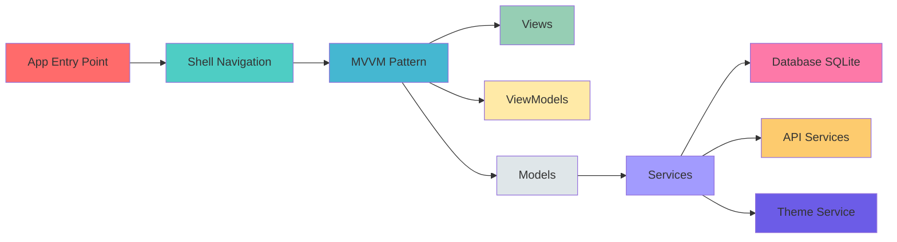
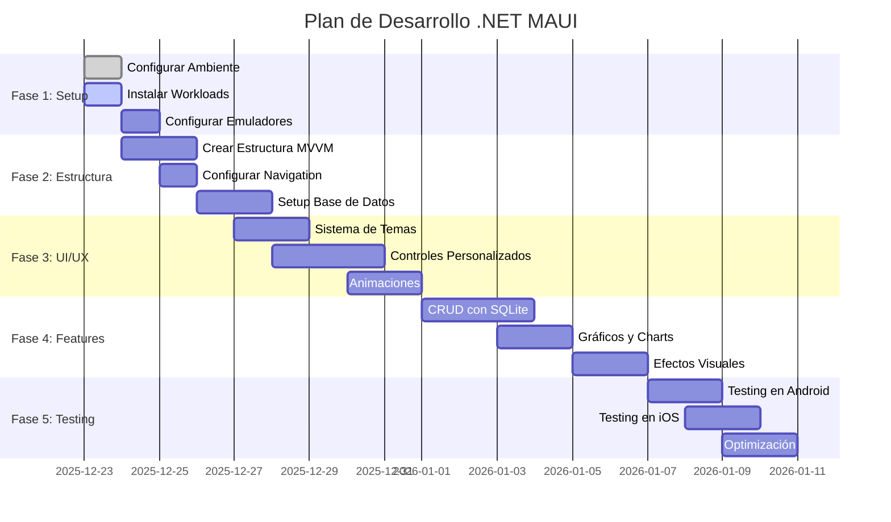
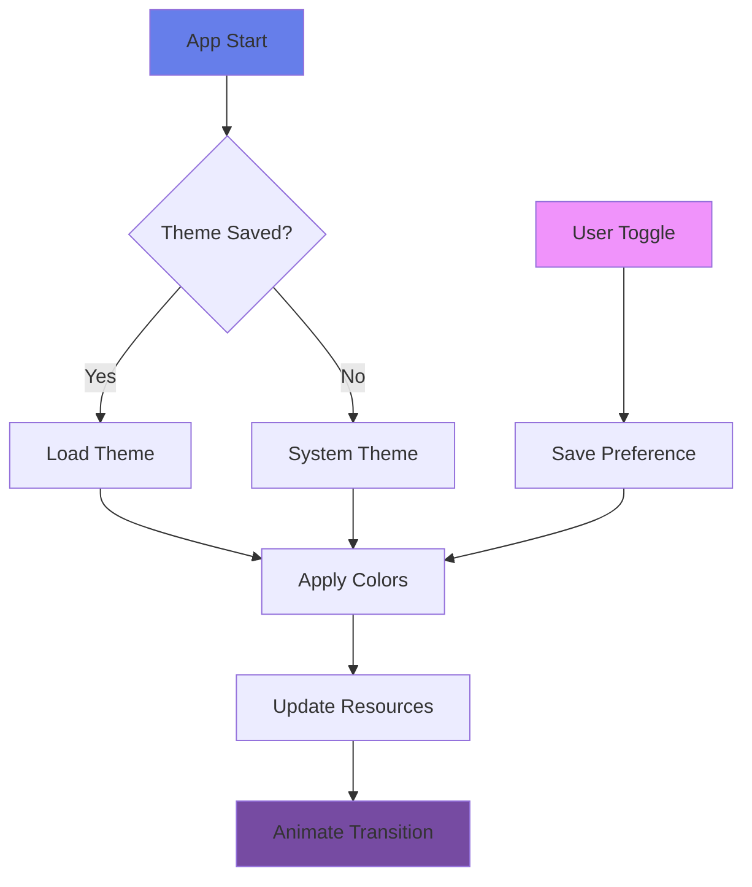
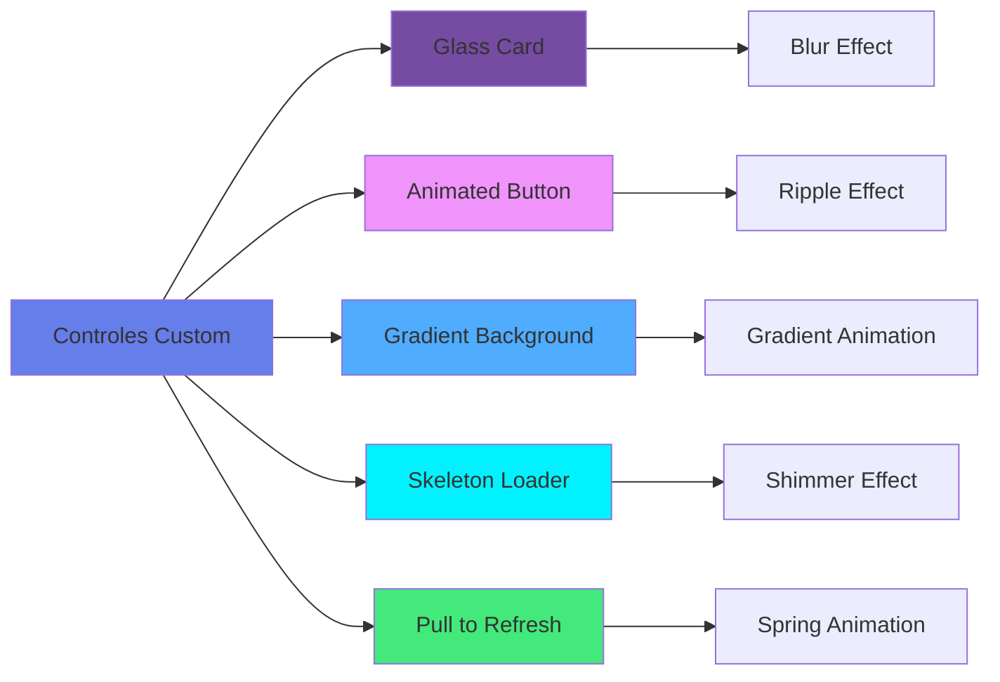
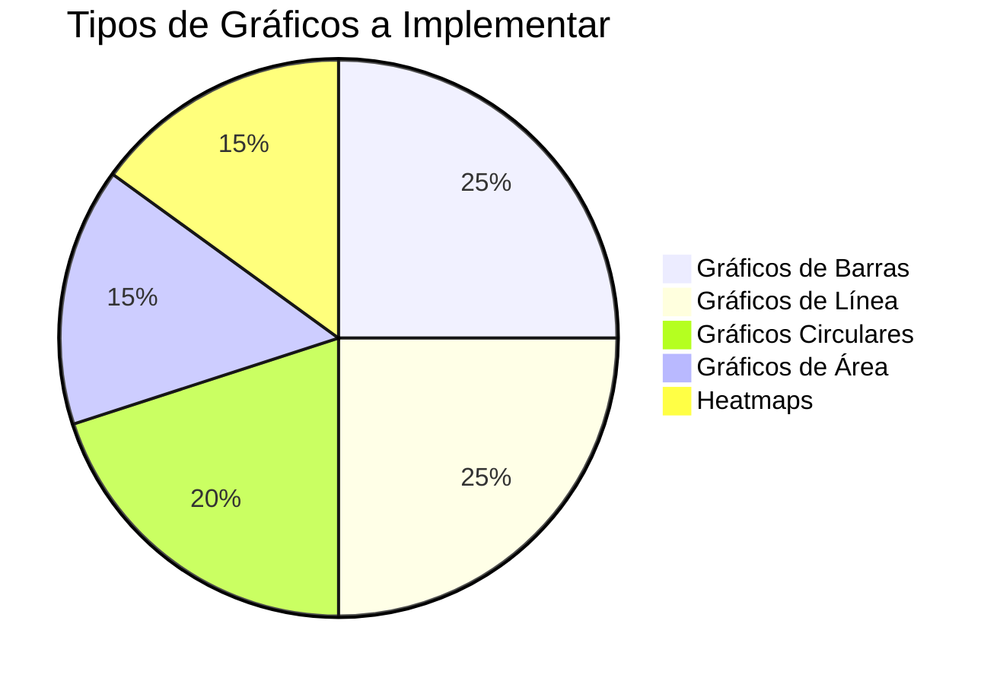
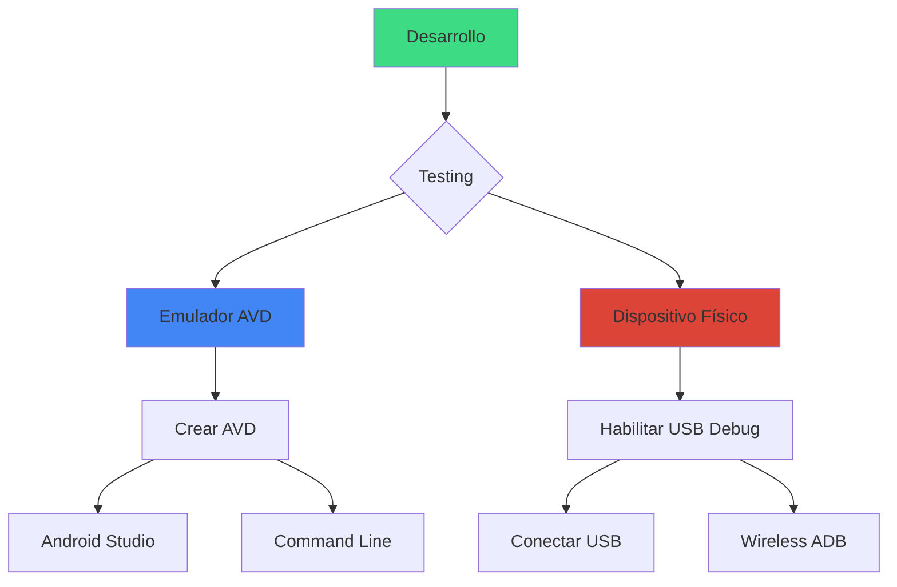
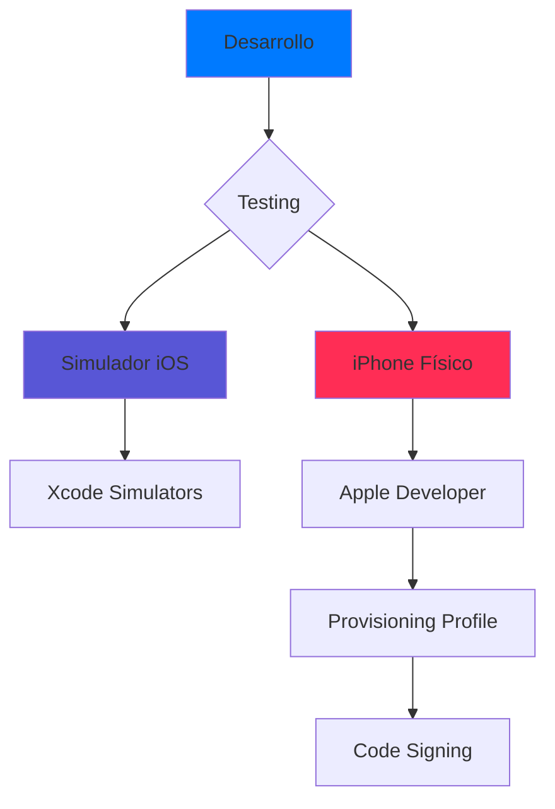

# 🚀 Guía Completa de Desarrollo .NET MAUI

## 📋 Índice
- [Introducción](#introducción)
- [Ambiente de Desarrollo](#ambiente-de-desarrollo)
- [Arquitectura del Proyecto](#arquitectura-del-proyecto)
- [Roadmap de Desarrollo](#roadmap-de-desarrollo)
- [Características "WOW"](#características-wow)
- [Checklist de Progreso](#checklist-de-progreso)

---

## 🎯 Introducción

Este documento sirve como acervo informático y guía de desarrollo para crear una aplicación móvil híbrida espectacular con .NET MAUI que demuestre todas sus capacidades avanzadas.

### Objetivo del Proyecto
Crear una aplicación móvil multiplataforma con:
- ✨ Interfaz moderna y atractiva
- 🌙 Modo oscuro/claro
- 💾 Base de datos local (SQLite)
- 🎨 Animaciones y transiciones fluidas
- 📱 Controles avanzados y personalizados
- 🔔 Notificaciones
- 📊 Gráficos y visualizaciones
- 🎭 Efectos visuales impresionantes

---

## 🛠️ Ambiente de Desarrollo

### 1. Requisitos del Sistema



### 2. Instalación de Herramientas

#### ✅ Paso 1: Instalar .NET SDK 9
```bash
# Verificar instalación
dotnet --version
# Salida esperada: 9.0.x
```

#### ✅ Paso 2: Instalar Workloads de MAUI
```bash
# Instalar workload de MAUI
dotnet workload install maui

# Instalar workload de Android (si no está)
dotnet workload install android

# Instalar workload de iOS (solo en macOS)
dotnet workload install ios

# Verificar workloads instalados
dotnet workload list
```

#### ✅ Paso 3: Configurar VS Code
Extensiones requeridas:
- ✅ C# Dev Kit (ms-dotnettools.csdevkit)
- ✅ .NET MAUI (ms-dotnettools.dotnet-maui)
- ✅ C# (ms-dotnettools.csharp)

### 3. Configuración de Emuladores

#### Android Emulator (Windows/macOS/Linux)
```bash
# Instalar Android SDK a través de .NET
dotnet build -t:InstallAndroidDependencies

# Crear emulador AVD
# Esto se hace desde Android Studio o línea de comandos
```

#### iOS Simulator (solo macOS)
```bash
# Verificar Xcode
xcode-select --install

# Listar simuladores disponibles
xcrun simctl list devices
```

---

## 🏗️ Arquitectura del Proyecto



### Estructura de Carpetas Propuesta

```
MiAppMaui/
├── 📁 Models/               # Modelos de datos
│   ├── User.cs
│   ├── Todo.cs
│   └── Note.cs
├── 📁 ViewModels/           # Lógica de presentación
│   ├── BaseViewModel.cs
│   ├── MainViewModel.cs
│   ├── TodoViewModel.cs
│   └── ProfileViewModel.cs
├── 📁 Views/                # Páginas XAML
│   ├── MainPage.xaml
│   ├── TodoPage.xaml
│   ├── ProfilePage.xaml
│   └── SettingsPage.xaml
├── 📁 Services/             # Servicios de la app
│   ├── DatabaseService.cs
│   ├── ThemeService.cs
│   ├── NotificationService.cs
│   └── AnimationService.cs
├── 📁 Controls/             # Controles personalizados
│   ├── GlassCard.xaml
│   ├── AnimatedButton.xaml
│   └── GradientBackground.xaml
├── 📁 Converters/           # Conversores de datos
│   └── BoolToColorConverter.cs
├── 📁 Behaviors/            # Comportamientos
│   └── FadeInBehavior.cs
├── 📁 Resources/            # Recursos
│   ├── 📁 Images/
│   ├── 📁 Fonts/
│   └── 📁 Styles/
│       ├── Colors.xaml
│       ├── Styles.xaml
│       └── Themes.xaml
└── 📁 Platforms/            # Código específico de plataforma
    ├── Android/
    ├── iOS/
    ├── Windows/
    └── MacCatalyst/
```

---

## 🗺️ Roadmap de Desarrollo



---

## ✨ Características "WOW"

### 1. 🎨 Sistema de Temas Avanzado



#### Características:
- 🌙 Modo oscuro/claro con transición suave
- 🎨 Múltiples temas predefinidos (Ocean, Sunset, Forest, Neon)
- 🔄 Sincronización con tema del sistema
- 💫 Animación de transición entre temas
- 💾 Persistencia de preferencias

### 2. 💾 Base de Datos Local (SQLite)

```csharp
// Ejemplo de estructura
public class DatabaseService
{
    SQLiteAsyncConnection Database;
    
    // CRUD Operations
    Task<List<T>> GetItemsAsync<T>();
    Task<T> GetItemAsync<T>(int id);
    Task<int> SaveItemAsync<T>(T item);
    Task<int> DeleteItemAsync<T>(T item);
}
```

#### Entidades Propuestas:
- 📝 **Notas**: Con categorías, colores, y búsqueda
- ✅ **Tareas**: Con prioridades y fechas
- 👤 **Perfil de Usuario**: Avatar, preferencias
- 📊 **Estadísticas**: Datos para gráficos

### 3. 🎭 Controles y Efectos Visuales



#### Efectos a Implementar:

1. **Glass Morphism Cards**
   - Fondo translúcido con blur
   - Bordes sutiles
   - Sombras suaves

2. **Animaciones de Entrada**
   - Fade In
   - Slide In
   - Scale Up
   - Bounce

3. **Transiciones de Página**
   - Push/Pop con animación
   - Fade Through
   - Shared Element Transition

4. **Micro-interacciones**
   - Botones con ripple effect
   - Feedback háptico
   - Iconos animados

### 4. 📊 Visualización de Datos



**Librería Sugerida**: Microcharts o LiveCharts2

### 5. 🎮 Gestos y Animaciones Interactivas

- 👆 Swipe to Delete
- 🔄 Pull to Refresh
- 👉 Pan Gesture
- 🔍 Pinch to Zoom
- 🌊 Parallax Scrolling
- ✨ Lottie Animations

### 6. 🔔 Sistema de Notificaciones

- Notificaciones locales
- Badges en iconos
- Toast messages personalizados
- In-app notifications con animación

---

## ✅ Checklist de Progreso

### Fase 1: Configuración del Ambiente ⏳
- [x] Instalar .NET 9 SDK
- [x] Crear proyecto MAUI
- [x] Instalar extensiones de VS Code
- [ ] Instalar workloads de MAUI
- [ ] Configurar emulador Android
- [ ] Configurar iOS Simulator (macOS)
- [ ] Verificar compilación inicial

### Fase 2: Estructura del Proyecto 📋
- [ ] Crear carpetas de arquitectura
- [ ] Implementar patrón MVVM
- [ ] Configurar Shell Navigation
- [ ] Crear BaseViewModel
- [ ] Setup Dependency Injection
- [ ] Configurar SQLite
- [ ] Crear modelos de datos

### Fase 3: Sistema de Temas 🎨
- [ ] Crear ThemeService
- [ ] Definir diccionarios de colores
- [ ] Implementar tema claro
- [ ] Implementar tema oscuro
- [ ] Crear temas adicionales (Ocean, Sunset, Neon)
- [ ] Animación de transición entre temas
- [ ] Persistir preferencia de tema
- [ ] Toggle de tema en Settings

### Fase 4: Base de Datos 💾
- [ ] Configurar SQLite-net-pcl
- [ ] Crear DatabaseService
- [ ] Implementar CRUD genérico
- [ ] Crear modelo User
- [ ] Crear modelo Note
- [ ] Crear modelo Todo
- [ ] Seed data inicial
- [ ] Testing de operaciones DB

### Fase 5: Navegación y Shell 🧭
- [ ] Configurar AppShell.xaml
- [ ] Crear FlyoutMenu personalizado
- [ ] Implementar TabBar
- [ ] Configurar rutas
- [ ] Transiciones entre páginas
- [ ] Deep linking
- [ ] Query parameters

### Fase 6: Controles Personalizados 🎭
- [ ] GlassCard control
- [ ] AnimatedButton control
- [ ] GradientBackground control
- [ ] SkeletonLoader control
- [ ] CustomEntry con iconos
- [ ] RatingControl
- [ ] ProgressRing animado
- [ ] SwipeView customizado

### Fase 7: Páginas Principales 📱

#### MainPage/Dashboard
- [ ] Layout responsivo
- [ ] Cards con estadísticas
- [ ] Gráficos de resumen
- [ ] Animación de entrada
- [ ] Pull to refresh

#### TodoPage
- [ ] Lista de tareas
- [ ] Swipe to delete
- [ ] Agregar/Editar tareas
- [ ] Filtros y búsqueda
- [ ] Prioridades con colores
- [ ] Animación de check/uncheck

#### NotesPage
- [ ] Grid/List view
- [ ] Colores por categoría
- [ ] Búsqueda de notas
- [ ] Editor de texto enriquecido
- [ ] Compartir notas
- [ ] Backup automático

#### ProfilePage
- [ ] Avatar con selector de imagen
- [ ] Información del usuario
- [ ] Estadísticas personales
- [ ] Achievements/Badges
- [ ] Gráficos de actividad

#### SettingsPage
- [ ] Theme switcher
- [ ] Configuración de notificaciones
- [ ] Preferencias de idioma
- [ ] Gestión de datos
- [ ] About/Info de la app

### Fase 8: Animaciones 🎬
- [ ] Fade animations
- [ ] Slide animations
- [ ] Scale animations
- [ ] Rotation animations
- [ ] Lottie animations
- [ ] Skeleton loading
- [ ] Page transitions
- [ ] Parallax effects

### Fase 9: Efectos Visuales ✨
- [ ] Blur effects
- [ ] Shadow effects
- [ ] Gradient animations
- [ ] Ripple effects
- [ ] Shimmer effects
- [ ] Particle effects
- [ ] Neumorphism styles
- [ ] Glass morphism

### Fase 10: Funcionalidades Avanzadas 🚀
- [ ] Búsqueda global
- [ ] Filtros avanzados
- [ ] Exportar datos (JSON/PDF)
- [ ] Compartir contenido
- [ ] Modo offline
- [ ] Sincronización (si aplica)
- [ ] Notificaciones push
- [ ] Feedback háptico

### Fase 11: Gráficos y Visualización 📊
- [ ] Instalar librería de gráficos
- [ ] Gráfico de barras
- [ ] Gráfico de líneas
- [ ] Gráfico circular
- [ ] Gráfico de área
- [ ] Animación de gráficos
- [ ] Interactividad en gráficos
- [ ] Exportar gráficos

### Fase 12: Testing y Optimización 🧪
- [ ] Testing en Android emulator
- [ ] Testing en dispositivo Android físico
- [ ] Testing en iOS simulator (macOS)
- [ ] Testing en iPhone físico (macOS)
- [ ] Testing en Windows
- [ ] Performance profiling
- [ ] Memory leak detection
- [ ] Optimización de imágenes
- [ ] Lazy loading
- [ ] Code cleanup

### Fase 13: Polish Final ✨
- [ ] Splash screen personalizada
- [ ] App icon
- [ ] Nombre y metadata
- [ ] Manejo de errores
- [ ] Loading states
- [ ] Empty states
- [ ] Mensajes de usuario
- [ ] Onboarding screens
- [ ] Tutorial interactivo

---

## 📚 Recursos y Referencias

### Documentación Oficial
- [Microsoft .NET MAUI Docs](https://learn.microsoft.com/dotnet/maui/)
- [.NET MAUI Community Toolkit](https://learn.microsoft.com/dotnet/communitytoolkit/maui/)
- [MAUI GitHub Samples](https://github.com/dotnet/maui-samples)

### Librerías Recomendadas

```xml
<!-- En MiAppMaui.csproj -->
<ItemGroup>
    <!-- Base de datos -->
    <PackageReference Include="sqlite-net-pcl" Version="1.9.172" />
    <PackageReference Include="SQLitePCLRaw.bundle_green" Version="2.1.8" />
    
    <!-- MVVM -->
    <PackageReference Include="CommunityToolkit.Mvvm" Version="8.2.2" />
    
    <!-- UI Components -->
    <PackageReference Include="CommunityToolkit.Maui" Version="7.0.0" />
    
    <!-- Gráficos -->
    <PackageReference Include="LiveChartsCore.SkiaSharpView.Maui" Version="2.0.0-rc2" />
    <!-- o -->
    <PackageReference Include="Microcharts.Maui" Version="1.0.0" />
    
    <!-- Animaciones -->
    <PackageReference Include="SkiaSharp.Extended.UI.Maui" Version="2.0.0" />
    
    <!-- JSON -->
    <PackageReference Include="Newtonsoft.Json" Version="13.0.3" />
</ItemGroup>
```

### Paleta de Colores Sugerida

#### Tema Light
```xml
<Color x:Key="Primary">#6366F1</Color>
<Color x:Key="Secondary">#EC4899</Color>
<Color x:Key="Tertiary">#8B5CF6</Color>
<Color x:Key="Success">#10B981</Color>
<Color x:Key="Warning">#F59E0B</Color>
<Color x:Key="Danger">#EF4444</Color>
<Color x:Key="Background">#F9FAFB</Color>
<Color x:Key="Surface">#FFFFFF</Color>
<Color x:Key="TextPrimary">#111827</Color>
<Color x:Key="TextSecondary">#6B7280</Color>
```

#### Tema Dark
```xml
<Color x:Key="Primary">#818CF8</Color>
<Color x:Key="Secondary">#F472B6</Color>
<Color x:Key="Tertiary">#A78BFA</Color>
<Color x:Key="Success">#34D399</Color>
<Color x:Key="Warning">#FBBF24</Color>
<Color x:Key="Danger">#F87171</Color>
<Color x:Key="Background">#111827</Color>
<Color x:Key="Surface">#1F2937</Color>
<Color x:Key="TextPrimary">#F9FAFB</Color>
<Color x:Key="TextSecondary">#9CA3AF</Color>
```

---

## 🎯 Ideas de Funcionalidades "WOW"

### 1. **Dashboard Animado**
- Cards que se animan al entrar
- Gráficos que se dibujan progresivamente
- Refresh animation elegante
- Skeleton loaders mientras carga

### 2. **Lista con Efectos Avanzados**
- Parallax en headers
- Swipe actions personalizados
- Drag & drop para reordenar
- Collapse/expand con animación

### 3. **Formularios Inteligentes**
- Validación en tiempo real
- Autocompletado
- Animación de errores
- Progress indicator

### 4. **Cámara y Galería**
- Tomar foto para avatar
- Filtros de imagen
- Crop y edición básica
- Gestión de permisos elegante

### 5. **Modo Offline First**
- Queue de operaciones
- Sincronización automática
- Indicador de estado
- Conflictos de sincronización

### 6. **Gamificación**
- Sistema de puntos
- Achievements
- Streaks
- Leaderboard local

---

## 🚀 Comandos Útiles

### Compilación y Ejecución

```bash
# Restaurar paquetes
dotnet restore

# Compilar
dotnet build

# Ejecutar en Android
dotnet build -t:Run -f net9.0-android

# Ejecutar en iOS (macOS)
dotnet build -t:Run -f net9.0-ios

# Ejecutar en Windows
dotnet build -t:Run -f net9.0-windows10.0.19041.0

# Ejecutar en macOS
dotnet build -t:Run -f net9.0-maccatalyst

# Limpiar proyecto
dotnet clean

# Ver dispositivos/emuladores disponibles
dotnet build -t:GetAllDevices

# Especificar dispositivo
dotnet build -t:Run -f net9.0-android -p:AndroidDevice="emulator-5554"
```

### Gestión de Workloads

```bash
# Ver workloads instalados
dotnet workload list

# Actualizar workloads
dotnet workload update

# Reparar workloads
dotnet workload repair

# Instalar workload específico
dotnet workload install maui-android
dotnet workload install maui-ios
dotnet workload install maui-windows
```

### Debugging

```bash
# Modo debug
dotnet build -c Debug

# Modo release
dotnet build -c Release

# Ver logs detallados
dotnet build -v detailed

# Hot reload
dotnet watch run
```

---

## 📱 Testing en Dispositivos

### Android



### iOS (macOS Only)



---

## 🎨 Próximos Pasos

1. **Instalar todos los workloads necesarios**
   ```bash
   dotnet workload install maui
   ```

2. **Configurar emuladores de prueba**
   - Android AVD
   - iOS Simulator (si estás en macOS)

3. **Estructurar el proyecto con MVVM**
   - Crear carpetas
   - Implementar patrón base

4. **Comenzar con la UI base**
   - Shell navigation
   - Páginas principales
   - Sistema de temas

5. **Implementar features incrementalmente**
   - Seguir el checklist
   - Testing continuo

---

## 📝 Notas de Desarrollo

### Convenciones de Código
- Usar async/await para operaciones asíncronas
- Implementar INotifyPropertyChanged en ViewModels
- Usar Commands para acciones de UI
- Separar lógica de negocio de presentación
- Comentar código complejo
- Usar naming conventions de C#

### Best Practices
- ✅ Usar ResourceDictionaries para estilos
- ✅ Implementar lazy loading
- ✅ Disponer de recursos correctamente
- ✅ Manejar excepciones apropiadamente
- ✅ Validar inputs del usuario
- ✅ Optimizar imágenes
- ✅ Usar compiled bindings cuando sea posible
- ✅ Implementar cancellation tokens

### Performance Tips
- Usar CollectionView en lugar de ListView
- Virtualización de listas
- Minimizar bindings complejos
- Usar compiled bindings
- Cachear recursos
- Lazy loading de páginas
- Comprimir imágenes

---

## 🎉 ¡Comencemos!

Este documento es una guía viva que se irá actualizando conforme avancemos. El objetivo es crear una aplicación que no solo funcione bien, sino que impresione con su diseño, animaciones y funcionalidades.

**¡Manos a la obra! 🚀**

---

*Última actualización: 23 de Diciembre, 2025*
