# 🚀 Guía Completa de Desarrollo .NET MAUI

## 📋 Índice
- [Introducción](#introducción)
- [Ambiente de Desarrollo](#ambiente-de-desarrollo)
- [Gitflow y Gestión de Ramas](#gitflow-y-gestión-de-ramas)
- [Arquitectura del Proyecto](#arquitectura-del-proyecto)
- [Roadmap de Desarrollo](#roadmap-de-desarrollo)
- [Características "WOW"](#características-wow)
- [Checklist de Progreso](#checklist-de-progreso)

---

## 🎯 Introducción

Este documento sirve como acervo informático y guía de desarrollo para crear una aplicación móvil híbrida espectacular con .NET MAUI que demuestre todas sus capacidades avanzadas.

### Objetivo del Proyecto
Crear una aplicación móvil multiplataforma con:
- ✨ Interfaz moderna y atractiva
- 🌙 Modo oscuro/claro
- 💾 Base de datos local (SQLite)
- 🎨 Animaciones y transiciones fluidas
- 📱 Controles avanzados y personalizados
- 🔔 Notificaciones
- 📊 Gráficos y visualizaciones
- 🎭 Efectos visuales impresionantes

---

## 🛠️ Ambiente de Desarrollo

### 1. Requisitos del Sistema

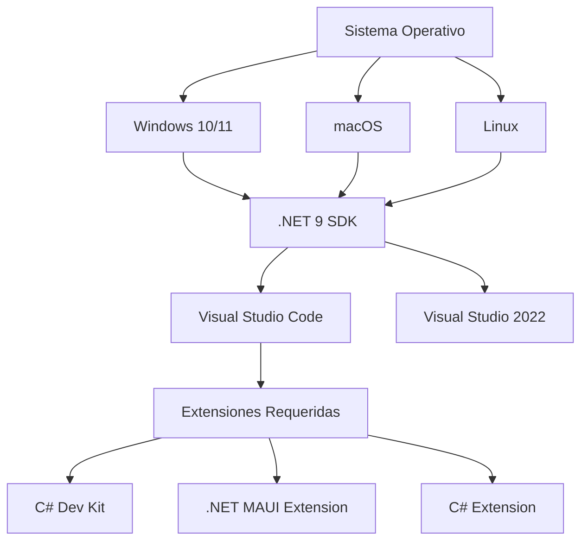

### 2. Instalación de Herramientas

#### ✅ Paso 1: Instalar .NET SDK 9
```bash
# Verificar instalación
dotnet --version
# Salida esperada: 9.0.x
```

#### ✅ Paso 2: Instalar Workloads de MAUI
```bash
# Instalar workload de MAUI
dotnet workload install maui

# Instalar workload de Android (si no está)
dotnet workload install android

# Instalar workload de iOS (solo en macOS)
dotnet workload install ios

# Verificar workloads instalados
dotnet workload list
```

#### ✅ Paso 3: Configurar VS Code
Extensiones requeridas:
- ✅ C# Dev Kit (ms-dotnettools.csdevkit)
- ✅ .NET MAUI (ms-dotnettools.dotnet-maui)
- ✅ C# (ms-dotnettools.csharp)

### 3. Configuración de Emuladores

#### Android Emulator (Windows/macOS/Linux)
```bash
# Instalar Android SDK a través de .NET
dotnet build -t:InstallAndroidDependencies

# Crear emulador AVD
# Esto se hace desde Android Studio o línea de comandos
```

#### iOS Simulator (solo macOS)
```bash
# Verificar Xcode
xcode-select --install

# Listar simuladores disponibles
xcrun simctl list devices
```

---

## 🌿 Gitflow y Gestión de Ramas

### 🎯 ¿Qué es Gitflow? (Explicación Simple)

Imagina que estás construyendo una casa. Gitflow es como organizar tu equipo de construcción:

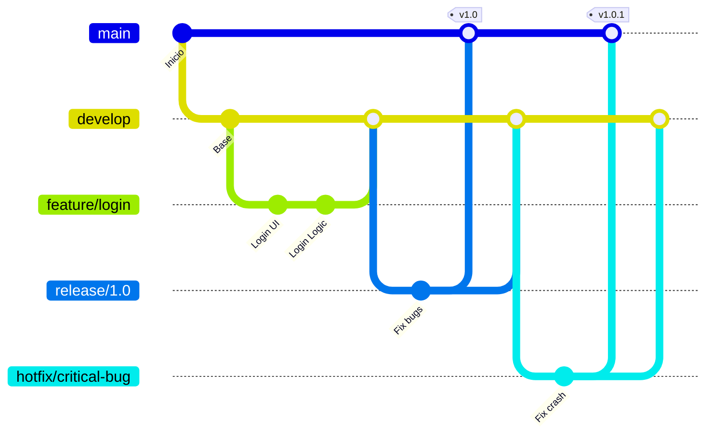

### 📚 Las 5 Ramas Principales

#### 1. **main** (Producción) 🏠
- **¿Qué es?** La versión "oficial" que está en la tienda/producción
- **Analogía**: La casa terminada que está lista para vender
- **Reglas**: 
  - ❌ NUNCA trabajas directamente aquí
  - ✅ Solo recibe código 100% probado y listo
  - 🏷️ Cada commit aquí = nueva versión (v1.0, v1.1, etc.)

#### 2. **develop** (Desarrollo) 🏗️
- **¿Qué es?** Donde integras todo lo que están haciendo
- **Analogía**: El plano general donde se juntan todos los planos individuales
- **Reglas**:
  - ❌ NUNCA trabajas directamente aquí
  - ✅ Aquí se juntan las features terminadas
  - 📦 Desde aquí salen las versiones para probar

#### 3. **feature/*** (Nueva Funcionalidad) 🔨
- **¿Qué es?** Una rama para cada cosa nueva que desarrolles
- **Analogía**: Un obrero trabajando en su propia área sin molestar a otros
- **Ejemplos**:
  - `feature/login` → Sistema de inicio de sesión
  - `feature/dark-theme` → Modo oscuro
  - `feature/todo-list` → Lista de tareas
- **Reglas**:
  - ✅ Trabajas libremente aquí
  - ✅ Cuando termines, la integras a `develop`
  - 🗑️ Se borra después de integrar

#### 4. **release/*** (Pre-lanzamiento) 📦
- **¿Qué es?** Preparación final antes de lanzar una versión
- **Analogía**: Inspección final antes de entregar la casa
- **Ejemplos**:
  - `release/1.0` → Primera versión
  - `release/2.0` → Segunda versión mayor
- **Reglas**:
  - 🐛 Solo correcciones de bugs pequeños
  - ❌ No se agregan features nuevas
  - ✅ Se integra a `main` Y `develop` cuando está lista

#### 5. **hotfix/*** (Reparación de Emergencia) 🚑
- **¿Qué es?** Para arreglar bugs URGENTES en producción
- **Analogía**: Plomero de emergencia cuando hay una fuga
- **Ejemplos**:
  - `hotfix/crash-on-startup` → App no abre
  - `hotfix/payment-error` → Error crítico en pagos
- **Reglas**:
  - 🔥 Solo para emergencias
  - ✅ Sale de `main`, se integra a `main` Y `develop`
  - ⚡ Rápido y directo

### 🎨 Flujo de Trabajo Visual

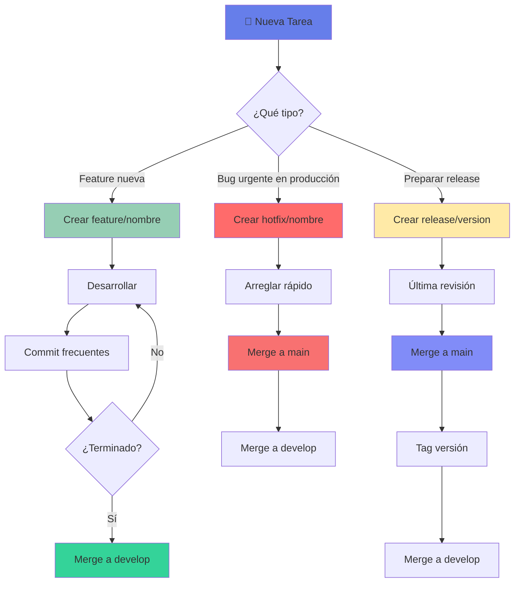

### 🚀 Comandos Prácticos de Gitflow

#### Configuración Inicial (Solo una vez)

```bash
# 1. Asegurarte de estar en main
git checkout main

# 2. Crear rama develop
git checkout -b develop

# 3. Subir develop al repositorio
git push -u origin develop
```

#### Trabajar en una Nueva Feature

```bash
# 1. Asegurarte de estar actualizado
git checkout develop
git pull origin develop

# 2. Crear rama feature
git checkout -b feature/nombre-de-tu-feature

# 3. Trabajar y hacer commits
git add .
git commit -m "feat: descripción de lo que hiciste"

# 4. Subir tu feature (opcional, para backup)
git push -u origin feature/nombre-de-tu-feature

# 5. Cuando termines, integrar a develop
git checkout develop
git pull origin develop
git merge feature/nombre-de-tu-feature

# 6. Subir develop con tu feature
git push origin develop

# 7. Borrar la rama feature (ya no la necesitas)
git branch -d feature/nombre-de-tu-feature
git push origin --delete feature/nombre-de-tu-feature
```

#### Preparar un Release

```bash
# 1. Desde develop, crear rama release
git checkout develop
git checkout -b release/1.0

# 2. Hacer ajustes finales (solo bugs, no features)
git add .
git commit -m "fix: corregir bug menor antes de release"

# 3. Cuando esté listo, integrar a main
git checkout main
git merge release/1.0

# 4. Etiquetar la versión
git tag -a v1.0 -m "Versión 1.0 - Primer release"
git push origin main --tags

# 5. También integrar a develop (para que tenga los fixes)
git checkout develop
git merge release/1.0
git push origin develop

# 6. Borrar rama release
git branch -d release/1.0
git push origin --delete release/1.0
```

#### Hotfix de Emergencia

```bash
# 1. Desde main, crear hotfix
git checkout main
git checkout -b hotfix/nombre-del-bug

# 2. Arreglar el bug
git add .
git commit -m "hotfix: descripción del arreglo urgente"

# 3. Integrar a main
git checkout main
git merge hotfix/nombre-del-bug

# 4. Etiquetar nueva versión
git tag -a v1.0.1 -m "Hotfix: descripción"
git push origin main --tags

# 5. También integrar a develop
git checkout develop
git merge hotfix/nombre-del-bug
git push origin develop

# 6. Borrar rama hotfix
git branch -d hotfix/nombre-del-bug
```

### 📋 Guía Rápida de Referencia

#### ¿En qué rama debo trabajar?

| Situación | Rama a usar | Comando |
|-----------|-------------|---------|
| Nueva funcionalidad | `feature/nombre` | `git checkout -b feature/nombre` |
| Bug normal | `feature/fix-nombre` | `git checkout -b feature/fix-nombre` |
| Bug urgente en producción | `hotfix/nombre` | `git checkout main && git checkout -b hotfix/nombre` |
| Preparar release | `release/version` | `git checkout develop && git checkout -b release/1.0` |
| Ver qué hay en producción | `main` | `git checkout main` |
| Ver últimos avances | `develop` | `git checkout develop` |

#### Comandos Útiles del Día a Día

```bash
# Ver en qué rama estás
git branch

# Ver todas las ramas (locales y remotas)
git branch -a

# Cambiar de rama
git checkout nombre-rama

# Ver el estado actual
git status

# Ver el historial bonito
git log --oneline --graph --all

# Actualizar tu rama con lo último de develop
git checkout tu-rama
git merge develop

# Ver diferencias antes de commit
git diff

# Deshacer último commit (conservando cambios)
git reset --soft HEAD~1

# Ver ramas remotas
git remote show origin
```

### 🎯 Convenciones de Nombres

#### Features
```bash
feature/login           # Sistema de login
feature/dark-theme      # Modo oscuro
feature/database        # Setup de base de datos
feature/charts          # Gráficos
feature/animations      # Animaciones
```

#### Fixes
```bash
feature/fix-navigation  # Arreglo de navegación
feature/fix-layout      # Arreglo de diseño
hotfix/crash-on-start   # Solo si es URGENTE en producción
```

#### Releases
```bash
release/1.0    # Primera versión
release/1.1    # Versión menor
release/2.0    # Versión mayor
```

### 💡 Tips y Mejores Prácticas

#### ✅ DO (Hazlo)
- ✅ Haz commits pequeños y frecuentes
- ✅ Usa mensajes descriptivos (`feat: agregar login`, no `cambios`)
- ✅ Mantén `develop` siempre funcional
- ✅ Haz pull antes de empezar a trabajar
- ✅ Borra ramas después de integrarlas
- ✅ Usa prefijos en commits: `feat:`, `fix:`, `ui:`, `docs:`
- ✅ Prueba tu código antes de merge

#### ❌ DON'T (No hagas)
- ❌ No trabajes directamente en `main` o `develop`
- ❌ No hagas commits gigantes
- ❌ No uses mensajes vagos (`fix`, `cambios`, `test`)
- ❌ No dejes ramas sin usar
- ❌ No hagas merge sin probar antes
- ❌ No subas archivos temporales o `bin/`, `obj/`
- ❌ No uses `git push -f` (force) a menos que sepas lo que haces

### 🎮 Ejemplo Práctico: Tu Primer Feature

Vamos a agregar el sistema de temas oscuros paso a paso:

```bash
# 1. Empezar desde develop actualizado
git checkout develop
git pull origin develop

# 2. Crear tu rama feature
git checkout -b feature/dark-theme

# 3. Hacer cambios en el código
# (Aquí desarrollas el tema oscuro)

# 4. Guardar tu progreso
git add .
git commit -m "feat: agregar colores para tema oscuro"

# 5. Continuar desarrollando
# (Más código...)
git add .
git commit -m "feat: agregar toggle de tema en settings"

# 6. Más desarrollo...
git add .
git commit -m "feat: persistir preferencia de tema"

# 7. Probar que todo funciona
dotnet build
dotnet run -f net9.0-windows10.0.19041.0

# 8. Si todo está bien, integrar a develop
git checkout develop
git pull origin develop          # Por si alguien más hizo cambios
git merge feature/dark-theme     # Integrar tu feature

# 9. Subir a GitHub
git push origin develop

# 10. Limpiar: borrar la rama feature
git branch -d feature/dark-theme
git push origin --delete feature/dark-theme  # Borrar del remoto también
```

### 📊 Estado Actual de las Ramas

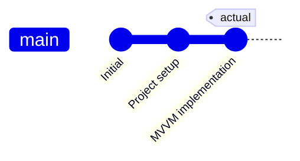

### 🚀 Próximos Pasos con Gitflow

1. ✅ **Crear rama `develop`** (lo haremos ahora)
2. 🔄 **Primera feature**: `feature/database-service`
3. 🔄 **Segunda feature**: `feature/models`
4. 🔄 **Tercera feature**: `feature/shell-navigation`
5. 📦 **Primer release**: `release/1.0` cuando tengamos features básicas completas

### 🎓 Recursos para Aprender Más

- [Gitflow Original](https://nvie.com/posts/a-successful-git-branching-model/)
- [GitHub Flow](https://docs.github.com/en/get-started/quickstart/github-flow) (alternativa más simple)
- [Git Cheat Sheet](https://education.github.com/git-cheat-sheet-education.pdf)

---

## 📚 ¿Qué es MVVM? (Explicación Simple)

### 🎯 La Analogía del Restaurante

Imagina que estás construyendo un restaurante. MVVM es como organizar tu restaurante en 3 áreas:

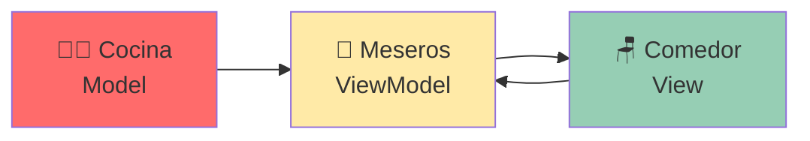

1. **View (Vista)** = **El Comedor** 🪑
   - Es lo que el cliente ve y toca
   - Los botones, etiquetas, cajas de texto
   - Solo se encarga de verse bonita
   - **Ejemplo**: El botón "Click me" en tu pantalla

2. **ViewModel** = **Los Meseros** 🔔
   - Hace de intermediario entre la cocina y el comedor
   - Toma las órdenes del cliente (clicks, inputs)
   - Trae la comida de la cocina
   - **Ejemplo**: El código que cuenta cuántos clicks has hecho

3. **Model (Modelo)** = **La Cocina** 👨‍🍳
   - Donde se prepara la comida (los datos)
   - La base de datos, archivos, internet
   - **Ejemplo**: Una lista de tareas guardadas en SQLite

### ✅ ¿Por qué es Mejor MVVM?

**SIN MVVM (Todo revuelto):**
```
❌ El mesero cocina, sirve y limpia
❌ Si cambias la receta, tienes que cambiar TODO
❌ Difícil de probar y mantener
```

**CON MVVM (Organizado):**
```
✅ Cada uno hace su trabajo
✅ Puedes cambiar la cocina sin tocar el comedor
✅ Puedes cambiar el diseño sin tocar la lógica
✅ Fácil de probar cada parte
```

### 🎨 MVVM en Nuestro Proyecto (Ejemplo Real)

Vamos a ver cómo funciona con el contador de clicks:

#### 1️⃣ **View (MainPage.xaml)** - Lo que VES
```xaml
<!-- El botón que el usuario ve y toca -->
<Button 
    Text="{Binding Counter, StringFormat='Clic: {0}'}" 
    Command="{Binding IncrementCounterCommand}" />
```
**En español**: "Botón, muestra el valor de Counter y cuando te toquen, ejecuta IncrementCounterCommand"

#### 2️⃣ **ViewModel (MainViewModel.cs)** - La LÓGICA
```csharp
public partial class MainViewModel : BaseViewModel
{
    [ObservableProperty]
    private int counter; // El número que se muestra
    
    [RelayCommand]
    private void IncrementCounter()
    {
        Counter++; // Aumenta el contador
        WelcomeMessage = $"Has hecho clic {Counter} veces";
    }
}
```
**En español**: 
- `Counter` es un número que la Vista puede mostrar
- `IncrementCounter` es lo que pasa cuando tocas el botón
- Cuando `Counter` cambia, la Vista se actualiza AUTOMÁTICAMENTE ✨

#### 3️⃣ **La Magia: Data Binding** 🪄

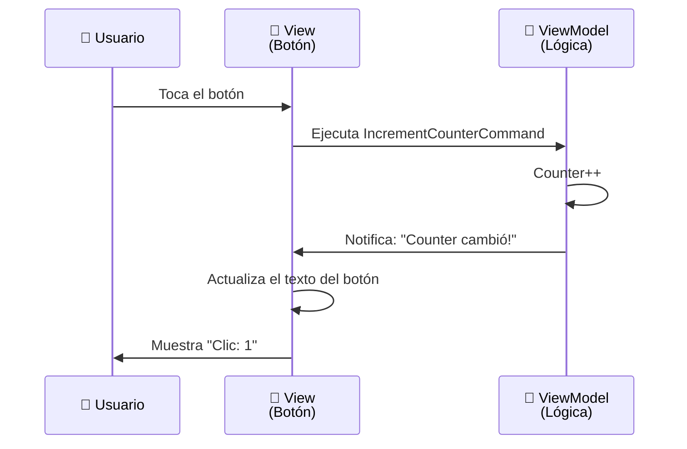

**Lo mágico**: No tienes que escribir código para actualizar la pantalla. ¡Se actualiza sola! 🎉

### 🛠️ Herramientas que Usamos

#### CommunityToolkit.Mvvm

Es como tener un asistente que escribe código aburrido por ti:

**Sin el toolkit (mucho código):**
```csharp
private int _counter;
public int Counter
{
    get => _counter;
    set
    {
        if (_counter != value)
        {
            _counter = value;
            OnPropertyChanged(nameof(Counter));
        }
    }
}
```

**Con el toolkit (código mágico ✨):**
```csharp
[ObservableProperty]
private int counter;
```
¡Una línea vs 10 líneas! El toolkit genera el resto automáticamente.

### 📋 Estructura de Nuestro Proyecto

Así organizamos los archivos:

```
MiAppMaui/
├── 📁 Views/                    ← Lo que VES (pantallas)
│   └── MainPage.xaml           "La interfaz bonita"
│
├── 📁 ViewModels/               ← La LÓGICA (cerebro)
│   ├── BaseViewModel.cs        "Funciones comunes para todos"
│   └── MainViewModel.cs        "Lógica de la página principal"
│
├── 📁 Models/                   ← Los DATOS (estructura)
│   └── (próximamente: Todo.cs, Note.cs)
│
└── 📁 Services/                 ← Los SERVICIOS (ayudantes)
    └── (próximamente: DatabaseService.cs)
```

### 🎯 Beneficios Reales en Nuestro Proyecto

| Beneficio | ¿Qué significa para ti? |
|-----------|------------------------|
| **Separación clara** | Si quieres cambiar el color de un botón → solo tocas la Vista<br/>Si quieres cambiar la lógica → solo tocas el ViewModel |
| **Reutilización** | El mismo ViewModel puede usarse en Android, iOS y Windows |
| **Testing fácil** | Puedes probar la lógica sin abrir la app visualmente |
| **Trabajo en equipo** | Un diseñador cambia la Vista, un programador cambia la lógica |
| **Mantenimiento** | Encuentras bugs más rápido porque todo está organizado |

### 🚀 ¿Cómo lo Usamos?

#### Paso 1: Registrar en `MauiProgram.cs`
```csharp
// Le decimos a la app: "Cuando alguien pida MainViewModel, crea uno"
builder.Services.AddSingleton<MainViewModel>();
builder.Services.AddSingleton<MainPage>();
```

#### Paso 2: Conectar en `MainPage.xaml.cs`
```csharp
public MainPage(MainViewModel viewModel)
{
    InitializeComponent();
    BindingContext = viewModel; // ¡Conectamos la Vista con el ViewModel!
}
```

#### Paso 3: Usar en `MainPage.xaml`
```xaml
<!-- Le decimos al compilador: "Este ViewModel tiene estas propiedades" -->
x:DataType="vm:MainViewModel"

<!-- Ahora podemos usar las propiedades -->
Text="{Binding Counter}"
Command="{Binding IncrementCounterCommand}"
```

### 💡 Tip para Principiantes

**Piensa en MVVM como una conversación:**

1. **Usuario**: Toca un botón (View)
2. **Botón**: "¡Oye ViewModel, me tocaron!" (Command)
3. **ViewModel**: "Ok, voy a hacer el trabajo..." (Lógica)
4. **ViewModel**: "¡Listo! El contador cambió" (Property Changed)
5. **View**: "¿Cambió? ¡Voy a actualizarme!" (Binding)
6. **Usuario**: Ve el cambio en la pantalla ✨

**Todo esto pasa AUTOMÁTICAMENTE con MVVM. No tienes que escribir código para cada paso.**

---

## 🏗️ Arquitectura del Proyecto

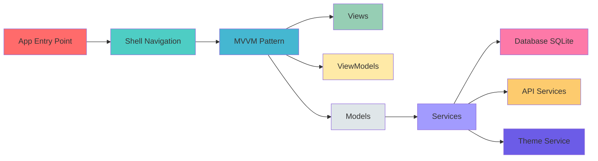

### Estructura de Carpetas Propuesta

```
MiAppMaui/
├── 📁 Models/               # Modelos de datos
│   ├── User.cs
│   ├── Todo.cs
│   └── Note.cs
├── 📁 ViewModels/           # Lógica de presentación
│   ├── BaseViewModel.cs
│   ├── MainViewModel.cs
│   ├── TodoViewModel.cs
│   └── ProfileViewModel.cs
├── 📁 Views/                # Páginas XAML
│   ├── MainPage.xaml
│   ├── TodoPage.xaml
│   ├── ProfilePage.xaml
│   └── SettingsPage.xaml
├── 📁 Services/             # Servicios de la app
│   ├── DatabaseService.cs
│   ├── ThemeService.cs
│   ├── NotificationService.cs
│   └── AnimationService.cs
├── 📁 Controls/             # Controles personalizados
│   ├── GlassCard.xaml
│   ├── AnimatedButton.xaml
│   └── GradientBackground.xaml
├── 📁 Converters/           # Conversores de datos
│   └── BoolToColorConverter.cs
├── 📁 Behaviors/            # Comportamientos
│   └── FadeInBehavior.cs
├── 📁 Resources/            # Recursos
│   ├── 📁 Images/
│   ├── 📁 Fonts/
│   └── 📁 Styles/
│       ├── Colors.xaml
│       ├── Styles.xaml
│       └── Themes.xaml
└── 📁 Platforms/            # Código específico de plataforma
    ├── Android/
    ├── iOS/
    ├── Windows/
    └── MacCatalyst/
```

---

## 🗺️ Roadmap de Desarrollo

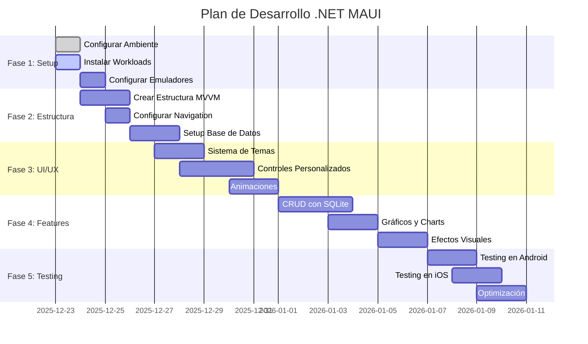

---

## ✨ Características "WOW"

### 1. 🎨 Sistema de Temas Avanzado

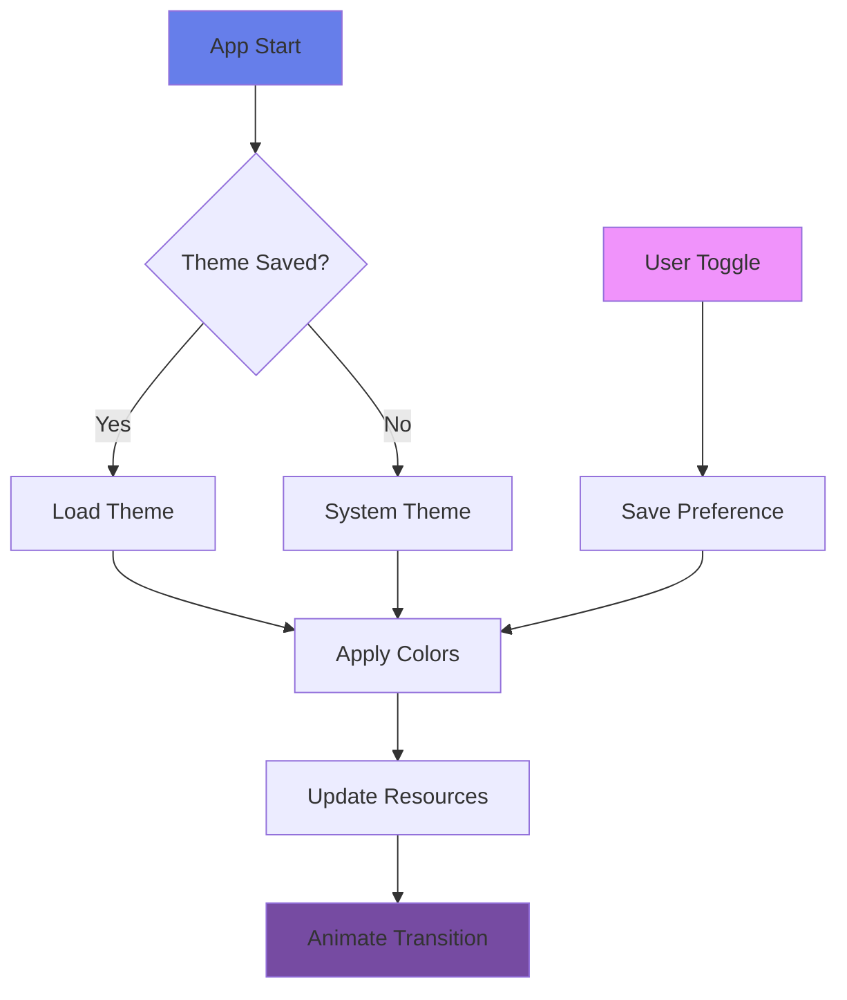

#### Características:
- 🌙 Modo oscuro/claro con transición suave
- 🎨 Múltiples temas predefinidos (Ocean, Sunset, Forest, Neon)
- 🔄 Sincronización con tema del sistema
- 💫 Animación de transición entre temas
- 💾 Persistencia de preferencias

### 2. 💾 Base de Datos Local (SQLite)

```csharp
// Ejemplo de estructura
public class DatabaseService
{
    SQLiteAsyncConnection Database;
    
    // CRUD Operations
    Task<List<T>> GetItemsAsync<T>();
    Task<T> GetItemAsync<T>(int id);
    Task<int> SaveItemAsync<T>(T item);
    Task<int> DeleteItemAsync<T>(T item);
}
```

#### Entidades Propuestas:
- 📝 **Notas**: Con categorías, colores, y búsqueda
- ✅ **Tareas**: Con prioridades y fechas
- 👤 **Perfil de Usuario**: Avatar, preferencias
- 📊 **Estadísticas**: Datos para gráficos

### 3. 🎭 Controles y Efectos Visuales

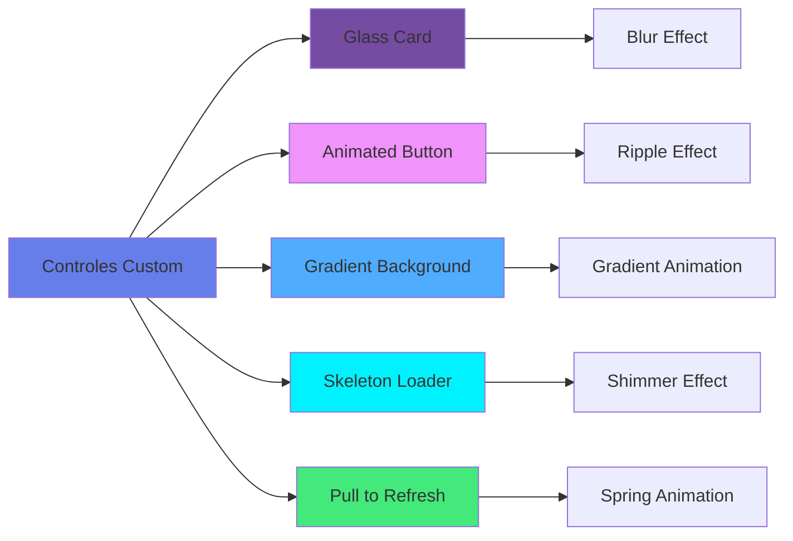

#### Efectos a Implementar:

1. **Glass Morphism Cards**
   - Fondo translúcido con blur
   - Bordes sutiles
   - Sombras suaves

2. **Animaciones de Entrada**
   - Fade In
   - Slide In
   - Scale Up
   - Bounce

3. **Transiciones de Página**
   - Push/Pop con animación
   - Fade Through
   - Shared Element Transition

4. **Micro-interacciones**
   - Botones con ripple effect
   - Feedback háptico
   - Iconos animados

### 4. 📊 Visualización de Datos

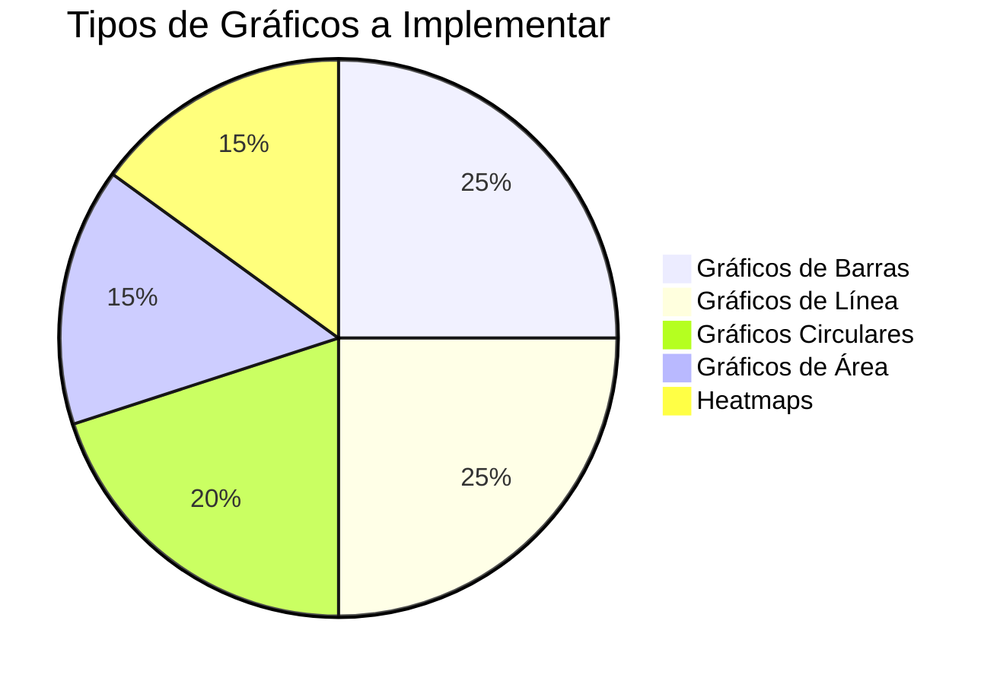

**Librería Sugerida**: Microcharts o LiveCharts2

### 5. 🎮 Gestos y Animaciones Interactivas

- 👆 Swipe to Delete
- 🔄 Pull to Refresh
- 👉 Pan Gesture
- 🔍 Pinch to Zoom
- 🌊 Parallax Scrolling
- ✨ Lottie Animations

### 6. 🔔 Sistema de Notificaciones

- Notificaciones locales
- Badges en iconos
- Toast messages personalizados
- In-app notifications con animación

---

## ✅ Checklist de Progreso

### Fase 1: Configuración del Ambiente ✅
- [x] Instalar .NET 9 SDK
- [x] Crear proyecto MAUI
- [x] Instalar extensiones de VS Code
- [x] Instalar workloads de MAUI (Android, iOS, macOS, Windows)
- [x] Verificar compilación inicial
- [x] Ejecutar app en Windows
- [x] Configurar .gitignore
- [x] Subir proyecto a GitHub
- [ ] Configurar emulador Android
- [ ] Configurar iOS Simulator (macOS)
- [ ] Testing en emulador Android
- [ ] Testing en iOS Simulator

### Fase 2: Estructura del Proyecto �
- [x] Crear carpetas de arquitectura (Models, ViewModels, Views, Services, etc.)
- [x] Implementar patrón MVVM con CommunityToolkit
- [x] Crear BaseViewModel con propiedades comunes
- [x] Crear MainViewModel con lógica de contador
- [x] Configurar Dependency Injection en MauiProgram
- [x] Instalar paquetes: CommunityToolkit.Mvvm, SQLite, CommunityToolkit.Maui
- [x] Migrar MainPage a arquitectura MVVM
- [ ] Configurar Shell Navigation avanzada
- [ ] Configurar SQLite DatabaseService
- [ ] Crear modelos de datos iniciales

### Fase 3: Sistema de Temas 🎨
- [ ] Crear ThemeService
- [ ] Definir diccionarios de colores
- [ ] Implementar tema claro
- [ ] Implementar tema oscuro
- [ ] Crear temas adicionales (Ocean, Sunset, Neon)
- [ ] Animación de transición entre temas
- [ ] Persistir preferencia de tema
- [ ] Toggle de tema en Settings

### Fase 4: Base de Datos 💾
- [ ] Configurar SQLite-net-pcl
- [ ] Crear DatabaseService
- [ ] Implementar CRUD genérico
- [ ] Crear modelo User
- [ ] Crear modelo Note
- [ ] Crear modelo Todo
- [ ] Seed data inicial
- [ ] Testing de operaciones DB

### Fase 5: Navegación y Shell 🧭
- [ ] Configurar AppShell.xaml
- [ ] Crear FlyoutMenu personalizado
- [ ] Implementar TabBar
- [ ] Configurar rutas
- [ ] Transiciones entre páginas
- [ ] Deep linking
- [ ] Query parameters

### Fase 6: Controles Personalizados 🎭
- [ ] GlassCard control
- [ ] AnimatedButton control
- [ ] GradientBackground control
- [ ] SkeletonLoader control
- [ ] CustomEntry con iconos
- [ ] RatingControl
- [ ] ProgressRing animado
- [ ] SwipeView customizado

### Fase 7: Páginas Principales 📱

#### MainPage/Dashboard
- [ ] Layout responsivo
- [ ] Cards con estadísticas
- [ ] Gráficos de resumen
- [ ] Animación de entrada
- [ ] Pull to refresh

#### TodoPage
- [ ] Lista de tareas
- [ ] Swipe to delete
- [ ] Agregar/Editar tareas
- [ ] Filtros y búsqueda
- [ ] Prioridades con colores
- [ ] Animación de check/uncheck

#### NotesPage
- [ ] Grid/List view
- [ ] Colores por categoría
- [ ] Búsqueda de notas
- [ ] Editor de texto enriquecido
- [ ] Compartir notas
- [ ] Backup automático

#### ProfilePage
- [ ] Avatar con selector de imagen
- [ ] Información del usuario
- [ ] Estadísticas personales
- [ ] Achievements/Badges
- [ ] Gráficos de actividad

#### SettingsPage
- [ ] Theme switcher
- [ ] Configuración de notificaciones
- [ ] Preferencias de idioma
- [ ] Gestión de datos
- [ ] About/Info de la app

### Fase 8: Animaciones 🎬
- [ ] Fade animations
- [ ] Slide animations
- [ ] Scale animations
- [ ] Rotation animations
- [ ] Lottie animations
- [ ] Skeleton loading
- [ ] Page transitions
- [ ] Parallax effects

### Fase 9: Efectos Visuales ✨
- [ ] Blur effects
- [ ] Shadow effects
- [ ] Gradient animations
- [ ] Ripple effects
- [ ] Shimmer effects
- [ ] Particle effects
- [ ] Neumorphism styles
- [ ] Glass morphism

### Fase 10: Funcionalidades Avanzadas 🚀
- [ ] Búsqueda global
- [ ] Filtros avanzados
- [ ] Exportar datos (JSON/PDF)
- [ ] Compartir contenido
- [ ] Modo offline
- [ ] Sincronización (si aplica)
- [ ] Notificaciones push
- [ ] Feedback háptico

### Fase 11: Gráficos y Visualización 📊
- [ ] Instalar librería de gráficos
- [ ] Gráfico de barras
- [ ] Gráfico de líneas
- [ ] Gráfico circular
- [ ] Gráfico de área
- [ ] Animación de gráficos
- [ ] Interactividad en gráficos
- [ ] Exportar gráficos

### Fase 12: Testing y Optimización 🧪
- [ ] Testing en Android emulator
- [ ] Testing en dispositivo Android físico
- [ ] Testing en iOS simulator (macOS)
- [ ] Testing en iPhone físico (macOS)
- [ ] Testing en Windows
- [ ] Performance profiling
- [ ] Memory leak detection
- [ ] Optimización de imágenes
- [ ] Lazy loading
- [ ] Code cleanup

### Fase 13: Polish Final ✨
- [ ] Splash screen personalizada
- [ ] App icon
- [ ] Nombre y metadata
- [ ] Manejo de errores
- [ ] Loading states
- [ ] Empty states
- [ ] Mensajes de usuario
- [ ] Onboarding screens
- [ ] Tutorial interactivo

---

## 📚 Recursos y Referencias

### Documentación Oficial
- [Microsoft .NET MAUI Docs](https://learn.microsoft.com/dotnet/maui/)
- [.NET MAUI Community Toolkit](https://learn.microsoft.com/dotnet/communitytoolkit/maui/)
- [MAUI GitHub Samples](https://github.com/dotnet/maui-samples)

### Librerías Recomendadas

```xml
<!-- En MiAppMaui.csproj -->
<ItemGroup>
    <!-- Base de datos -->
    <PackageReference Include="sqlite-net-pcl" Version="1.9.172" />
    <PackageReference Include="SQLitePCLRaw.bundle_green" Version="2.1.8" />
    
    <!-- MVVM -->
    <PackageReference Include="CommunityToolkit.Mvvm" Version="8.2.2" />
    
    <!-- UI Components -->
    <PackageReference Include="CommunityToolkit.Maui" Version="7.0.0" />
    
    <!-- Gráficos -->
    <PackageReference Include="LiveChartsCore.SkiaSharpView.Maui" Version="2.0.0-rc2" />
    <!-- o -->
    <PackageReference Include="Microcharts.Maui" Version="1.0.0" />
    
    <!-- Animaciones -->
    <PackageReference Include="SkiaSharp.Extended.UI.Maui" Version="2.0.0" />
    
    <!-- JSON -->
    <PackageReference Include="Newtonsoft.Json" Version="13.0.3" />
</ItemGroup>
```

### Paleta de Colores Sugerida

#### Tema Light
```xml
<Color x:Key="Primary">#6366F1</Color>
<Color x:Key="Secondary">#EC4899</Color>
<Color x:Key="Tertiary">#8B5CF6</Color>
<Color x:Key="Success">#10B981</Color>
<Color x:Key="Warning">#F59E0B</Color>
<Color x:Key="Danger">#EF4444</Color>
<Color x:Key="Background">#F9FAFB</Color>
<Color x:Key="Surface">#FFFFFF</Color>
<Color x:Key="TextPrimary">#111827</Color>
<Color x:Key="TextSecondary">#6B7280</Color>
```

#### Tema Dark
```xml
<Color x:Key="Primary">#818CF8</Color>
<Color x:Key="Secondary">#F472B6</Color>
<Color x:Key="Tertiary">#A78BFA</Color>
<Color x:Key="Success">#34D399</Color>
<Color x:Key="Warning">#FBBF24</Color>
<Color x:Key="Danger">#F87171</Color>
<Color x:Key="Background">#111827</Color>
<Color x:Key="Surface">#1F2937</Color>
<Color x:Key="TextPrimary">#F9FAFB</Color>
<Color x:Key="TextSecondary">#9CA3AF</Color>
```

---

## 🎯 Ideas de Funcionalidades "WOW"

### 1. **Dashboard Animado**
- Cards que se animan al entrar
- Gráficos que se dibujan progresivamente
- Refresh animation elegante
- Skeleton loaders mientras carga

### 2. **Lista con Efectos Avanzados**
- Parallax en headers
- Swipe actions personalizados
- Drag & drop para reordenar
- Collapse/expand con animación

### 3. **Formularios Inteligentes**
- Validación en tiempo real
- Autocompletado
- Animación de errores
- Progress indicator

### 4. **Cámara y Galería**
- Tomar foto para avatar
- Filtros de imagen
- Crop y edición básica
- Gestión de permisos elegante

### 5. **Modo Offline First**
- Queue de operaciones
- Sincronización automática
- Indicador de estado
- Conflictos de sincronización

### 6. **Gamificación**
- Sistema de puntos
- Achievements
- Streaks
- Leaderboard local

---

## 🚀 Comandos Útiles

### Compilación y Ejecución

```bash
# Restaurar paquetes
dotnet restore

# Compilar todas las plataformas
dotnet build

# Compilar solo una plataforma específica
dotnet build -f net9.0-android
dotnet build -f net9.0-windows10.0.19041.0

# ✅ Ejecutar en Windows (más rápido para testing rápido)
dotnet build -t:Run -f net9.0-windows10.0.19041.0

# Ejecutar en Android (requiere emulador o dispositivo)
dotnet build -t:Run -f net9.0-android

# Ejecutar en iOS Simulator (solo macOS)
dotnet build -t:Run -f net9.0-ios

# Ejecutar en macOS (solo macOS)
dotnet build -t:Run -f net9.0-maccatalyst

# Limpiar proyecto
dotnet clean

# Hot Reload (recarga automática al guardar cambios)
dotnet watch run -f net9.0-windows10.0.19041.0

# Especificar dispositivo Android específico
# Primero ver dispositivos: adb devices
dotnet build -t:Run -f net9.0-android -p:_DeviceName="emulator-5554"
```

### Gestión de Workloads

```bash
# Ver workloads instalados
dotnet workload list

# Actualizar workloads
dotnet workload update

# Reparar workloads
dotnet workload repair

# Instalar workload específico
dotnet workload install maui-android
dotnet workload install maui-ios
dotnet workload install maui-windows
```

### Debugging

```bash
# Modo debug
dotnet build -c Debug

# Modo release
dotnet build -c Release

# Ver logs detallados
dotnet build -v detailed

# Hot reload
dotnet watch run
```

---

## 📱 Testing en Dispositivos

### Android

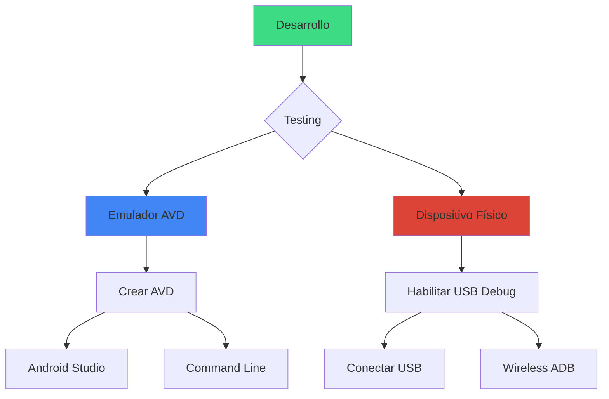

### iOS (macOS Only)

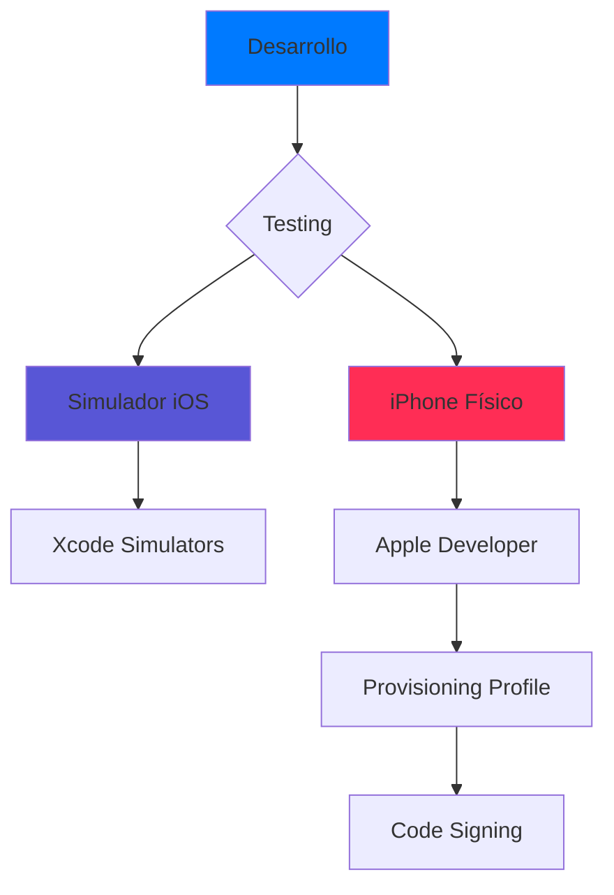

---

## 🎨 Próximos Pasos

1. **Instalar todos los workloads necesarios**
   ```bash
   dotnet workload install maui
   ```

2. **Configurar emuladores de prueba**
   - Android AVD
   - iOS Simulator (si estás en macOS)

3. **Estructurar el proyecto con MVVM**
   - Crear carpetas
   - Implementar patrón base

4. **Comenzar con la UI base**
   - Shell navigation
   - Páginas principales
   - Sistema de temas

5. **Implementar features incrementalmente**
   - Seguir el checklist
   - Testing continuo

---

## 📝 Notas de Desarrollo

### Convenciones de Código
- Usar async/await para operaciones asíncronas
- Implementar INotifyPropertyChanged en ViewModels
- Usar Commands para acciones de UI
- Separar lógica de negocio de presentación
- Comentar código complejo
- Usar naming conventions de C#

### Best Practices
- ✅ Usar ResourceDictionaries para estilos
- ✅ Implementar lazy loading
- ✅ Disponer de recursos correctamente
- ✅ Manejar excepciones apropiadamente
- ✅ Validar inputs del usuario
- ✅ Optimizar imágenes
- ✅ Usar compiled bindings cuando sea posible
- ✅ Implementar cancellation tokens

### Performance Tips
- Usar CollectionView en lugar de ListView
- Virtualización de listas
- Minimizar bindings complejos
- Usar compiled bindings
- Cachear recursos
- Lazy loading de páginas
- Comprimir imágenes

---

## � Estado Actual del Proyecto

### ✅ Completado
- ✅ Proyecto base MAUI creado y funcionando
- ✅ Todos los workloads instalados (Android, iOS, Windows, macOS)
- ✅ Compilación exitosa en todas las plataformas
- ✅ App ejecutándose en Windows
- ✅ .gitignore configurado correctamente
- ✅ Proyecto subido a GitHub: [erdnando/myNetMaui](https://github.com/erdnando/myNetMaui)
- ✅ Arquitectura MVVM implementada con CommunityToolkit
- ✅ Dependency Injection configurada
- ✅ Estructura de carpetas organizada (Models, ViewModels, Views, Services)
- ✅ Paquetes instalados: CommunityToolkit.Mvvm, SQLite, CommunityToolkit.Maui

### 🔄 Próximos Pasos Inmediatos
1. **Configurar DatabaseService** con SQLite para persistir datos
2. **Crear modelos de datos** (Todo, Note, User)
3. **Implementar Shell Navigation** con TabBar y Flyout
4. **Sistema de temas** (modo oscuro/claro)

### 📊 Progreso General
```
Fase 1: Configuración    ██████████ 100% ✅
Fase 2: Estructura       ███████░░░  70% 🔄
Fase 3: Temas           ░░░░░░░░░░   0%
```

---

## 💡 Best Practices - Flujo de Desarrollo Óptimo

### 🚀 Desarrollo Iterativo Rápido

**Recomendación para desarrollo diario:**

1. **Windows primero** - Para desarrollo rápido con Hot Reload
   ```bash
   # Modo desarrollo con recarga automática
   dotnet watch run -f net9.0-windows10.0.19041.0
   ```

2. **Android después** - Para validar funcionalidades mobile
   ```bash
   # Ejecutar en emulador Android
   dotnet build -t:Run -f net9.0-android
   ```

3. **iOS ocasionalmente** - Para asegurar compatibilidad (solo macOS)

### 📱 Orden de Testing Recomendado

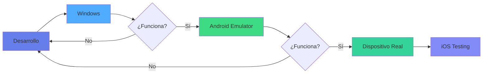

**Tiempos aproximados de compilación:**
- 🪟 Windows: ~10-20 segundos
- 🤖 Android: ~30-60 segundos (primera vez), ~10-15s después
- 🍎 iOS: ~20-40 segundos

### 🛠️ Configuración de Emulador Android

**Paso a paso:**

1. **Instalar Android Studio**
   - Descargar de: https://developer.android.com/studio
   - Incluye SDK y herramientas necesarias

2. **Crear Virtual Device (AVD)**
   ```
   Android Studio → Tools → Device Manager → Create Device
   
   Recomendado:
   - Device: Pixel 5 o Pixel 7
   - API Level: 34 (Android 14) o 35 (Android 15)
   - System Image: Google APIs (x86_64)
   - RAM: 2-4 GB
   - Storage: 2-8 GB
   ```

3. **Iniciar emulador**
   - Desde Android Studio Device Manager
   - O desde terminal:
     ```bash
     # Listar emuladores
     emulator -list-avds
     
     # Iniciar emulador
     emulator -avd Pixel_5_API_34
     ```

4. **Verificar conexión**
   ```bash
   # Ver dispositivos conectados
   adb devices
   # Debería mostrar: emulator-5554 device
   ```

5. **Ejecutar app**
   ```bash
   dotnet build -t:Run -f net9.0-android
   ```

### 🎯 Workflow de Trabajo Diario

```mermaid
gantt
    title Ciclo de Desarrollo Típico
    dateFormat HH:mm
    section Morning
    Escribir código           :a1, 09:00, 45m
    Test en Windows           :a2, 09:45, 10m
    Test en Android           :a3, 09:55, 15m
    section Afternoon
    Nueva feature             :a4, 10:10, 60m
    Test integrado            :a5, 11:10, 20m
    Commit & Push             :a6, 11:30, 10m
```

### 📝 Convención de Commits

```bash
# Tipos de commits
feat:     Nueva funcionalidad
fix:      Corrección de bug
ui:       Cambios visuales/diseño
refactor: Reestructuración de código
docs:     Documentación
perf:     Mejoras de rendimiento
test:     Tests

# Ejemplos:
git commit -m "feat: agregar tema oscuro con animación suave"
git commit -m "fix: corregir crash al abrir perfil"
git commit -m "ui: mejorar diseño de cards con glass morphism"
git commit -m "docs: actualizar checklist en MyNetMaui.md"
```

### 🐛 Debugging Efectivo

**Configurar logging:**
```csharp
// En MauiProgram.cs
#if DEBUG
    builder.Logging.AddDebug();
    builder.Logging.SetMinimumLevel(LogLevel.Debug);
#endif

// Usar en código:
_logger.LogDebug("Cargando {Count} items", items.Count);
_logger.LogError(ex, "Error al guardar en DB");
```

**Hot Reload automático:**
```bash
# Guarda y recarga automáticamente
dotnet watch run -f net9.0-windows10.0.19041.0
```

### ⚡ Performance Tips Desde el Inicio

**XAML Optimizado:**
```xaml
<!-- ✅ BUENO: Compiled bindings (más rápido) -->
<Label Text="{Binding Title}" 
       x:DataType="vm:MainViewModel"/>

<!-- ❌ EVITAR: Reflexión -->
<Label Text="{Binding Title}"/>

<!-- ✅ BUENO: CollectionView para listas -->
<CollectionView ItemsSource="{Binding Items}"/>

<!-- ❌ EVITAR: ListView (más lento) -->
<ListView ItemsSource="{Binding Items}"/>
```

**Código Optimizado:**
```csharp
// ✅ BUENO: Async/await para operaciones largas
public async Task LoadDataAsync()
{
    IsBusy = true;
    Items = await _database.GetItemsAsync();
    IsBusy = false;
}

// ✅ BUENO: Dispose de recursos
public void Dispose()
{
    _database?.Dispose();
    _httpClient?.Dispose();
}
```

---

## 📝 Notas de Desarrollo

### Convenciones de Código
- Usar async/await para operaciones asíncronas
- Implementar INotifyPropertyChanged en ViewModels (o usar CommunityToolkit.Mvvm)
- Usar Commands para acciones de UI
- Separar lógica de negocio de presentación
- Comentar código complejo
- Usar naming conventions de C#
- Namespace por carpeta

### Best Practices Actualizadas
- ✅ Usar ResourceDictionaries para estilos compartidos
- ✅ Implementar lazy loading para mejorar inicio
- ✅ Disponer de recursos correctamente (IDisposable)
- ✅ Manejar excepciones con try-catch apropiados
- ✅ Validar inputs del usuario antes de procesarlos
- ✅ Optimizar imágenes (usar WebP, comprimir, dimensiones correctas)
- ✅ Usar compiled bindings (x:DataType) siempre que sea posible
- ✅ Implementar cancellation tokens para operaciones cancelables
- ✅ Usar CollectionView en lugar de ListView
- ✅ Evitar layouts anidados innecesarios
- ✅ Cachear recursos pesados (fuentes, imágenes)
- ✅ Testing continuo en plataforma objetivo

### Performance Tips
- Usar CollectionView en lugar de ListView (mejor virtualización)
- Virtualización automática de listas largas
- Minimizar bindings complejos (conversiones, cálculos)
- Usar compiled bindings con x:DataType
- Cachear recursos estáticos (colores, estilos, fuentes)
- Lazy loading de páginas pesadas
- Comprimir y optimizar imágenes (WebP preferido)
- Evitar transparencias innecesarias
- Usar BindableLayout solo para listas pequeñas (<10 items)

---

## 🎉 ¡Estamos en Marcha!

### ✅ Lo que ya funciona:
- App compilando correctamente
- Ejecutándose en Windows
- Lista para desarrollar features

### 🎯 Siguiente hito:
**Configurar emulador Android y validar que la app corre correctamente en ambiente mobile**

Este documento es una guía viva que se irá actualizando conforme avancemos. El objetivo es crear una aplicación que no solo funcione bien, sino que impresione con su diseño, animaciones y funcionalidades.

**¡Manos a la obra! 🚀**

---

*Última actualización: 23 de Diciembre, 2025 - 19:30*
*Estado: ✅ Fase 1 completada | 🔄 Fase 2 al 70% - MVVM implementado y funcionando*
